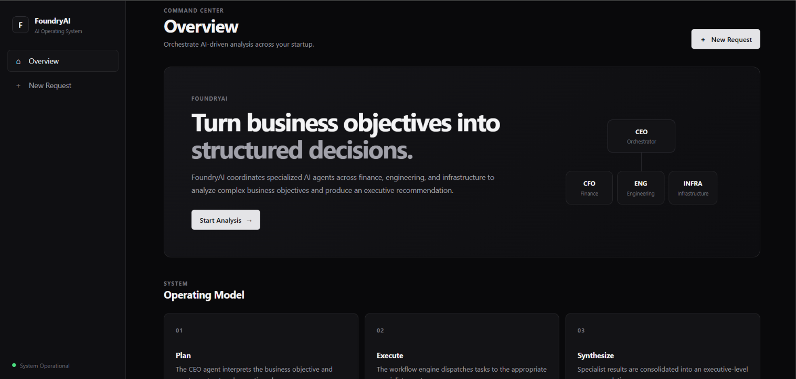
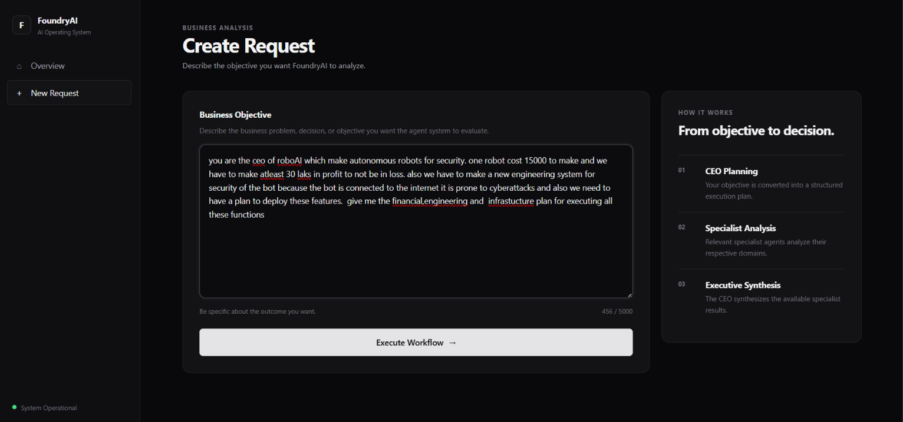
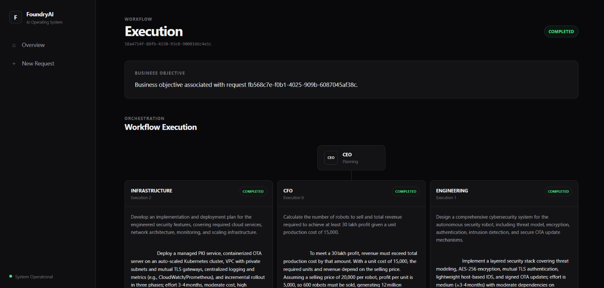
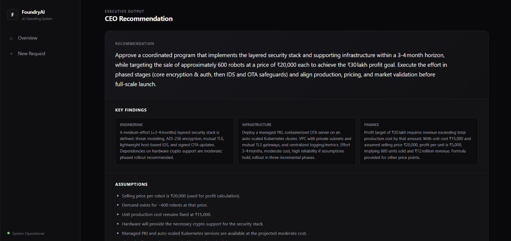

# FoundryAI

## Agentic AI Operating System for a FinTech Startup

FoundryAI is a Java/Spring Boot application that transforms a business objective into a structured, multi-agent workflow.

A CEO/Orchestrator agent decomposes the objective into specialist tasks, the workflow engine executes those tasks according to their dependencies, and the CEO synthesizes the resulting analysis into an executive recommendation.

The project is intentionally implemented as a **single Spring Boot application** rather than a distributed multi-agent platform. The architecture focuses on clear separation of responsibilities, extensibility, structured AI outputs, deterministic tool execution, and persistent workflow execution history.

---

## Dashboard



The dashboard provides the primary entry point into FoundryAI, allowing users to create business requests and navigate through workflow executions.

---

## Workflow Execution



The workflow view presents the execution of specialist tasks and the resulting CEO-level recommendation.

---

## Example Executive Recommendation




---

# Core Workflow

A business objective moves through the system as follows:

```text
User Request
     ↓
RequestController
     ↓
RequestService
     ↓
WorkflowService
     ↓
CEO Planning
     ↓
ExecutionPlan
     ↓
WorkflowEngine
     ↓
TaskDependencyResolver
     ↓
TaskContextBuilder
     ↓
WorkflowTaskDispatcher
     ↓
AgentRegistry
     ├── CFOAgent
     ├── EngineeringAgent
     └── InfrastructureAgent
     ↓
AgentResult
     ↓
CEO Synthesis
     ↓
CEORecommendationResponseDTO
````

The core responsibility boundaries are:

```text
CEO       → WHAT needs to be done
Workflow  → WHEN / WHETHER a task executes
Agent     → HOW the task is reasoned about
Tool      → HOW a deterministic operation is performed
```

This separation keeps orchestration independent from individual agent implementations and allows additional agents, tools, and workflow capabilities to be introduced without redesigning the core runtime.

---

# Current MVP

The current MVP implements four agent types:

```text
CEO / Orchestrator
CFO
Engineering
Infrastructure
```

### Core capabilities

* Structured CEO planning
* Specialist agent execution
* Dependency-aware workflow execution
* Dependency-result context propagation
* Agent registry and typed agent contracts
* Agent-specific model configuration
* Centralized model routing
* Structured LLM responses
* Deterministic financial tool execution
* CEO result synthesis
* REST-based workflow execution
* Persistent workflow and execution history
* MySQL persistence
* Unit and integration testing

The system is deliberately kept synchronous and single-process in the current MVP.

---

# Architecture

FoundryAI follows a hierarchical multi-agent architecture.

```text
                         User
                           │
                           ▼
                    Business Objective
                           │
                           ▼
                    CEO / Orchestrator
                           │
                           ▼
                     Execution Plan
                           │
                           ▼
                    Workflow Engine
                           │
              ┌────────────┼────────────┐
              │            │            │
              ▼            ▼            ▼
             CFO      Engineering   Infrastructure
              │            │            │
              └────────────┼────────────┘
                           │
                           ▼
                      Agent Results
                           │
                           ▼
                    CEO / Synthesis
                           │
                           ▼
                Executive Recommendation
```

### Agent execution model

Agents implement a common runtime contract:

```text
Agent
 ├── getType()
 └── execute(AgentTask)
```

The `AgentRegistry` maps `AgentType` to its corresponding agent implementation.

This prevents the workflow engine from depending directly on concrete agent classes.

---

# Workflow Execution

The workflow engine operates on an `ExecutionPlan` generated from the business objective.

Each planned task contains:

```text
taskKey
agentType
objective
dependencies
```

Dependencies reference other workflow tasks.

The workflow runtime:

1. Validates the execution plan.
2. Determines which tasks are runnable.
3. Resolves dependency results.
4. Builds the task context.
5. Dispatches the task through the `WorkflowTaskDispatcher`.
6. Resolves the appropriate agent through `AgentRegistry`.
7. Executes the agent.
8. Stores the resulting `AgentResult`.
9. Makes successful results available to dependent tasks.
10. Produces a final `WorkflowResult`.

Failed or blocked dependencies prevent dependent tasks from executing.

---

# AI Architecture

FoundryAI uses Spring AI to integrate LLM capabilities.

```text
Agent
  ↓
AiModelGateway
  ↓
ModelRouter
  ↓
Agent-specific configuration
  ↓
Spring AI ChatClient
  ↓
Groq
```

The AI layer is intentionally abstracted behind `AiModelGateway`.

This allows the agent layer to remain independent from the underlying model provider.

### Structured AI responses

The system uses Spring AI's structured response mapping:

```java
.entity(...)
```

with:

```java
.validateSchema()
```

instead of manually parsing arbitrary JSON returned by the model.

The main structured outputs include:

```text
StructuredAgentResponse
PlannedTask
CEORecommendationResponseDTO
```

This keeps LLM output handling closer to the application's domain contracts and allows Spring AI to validate the generated structure.

---

# Model Configuration

Agent-specific AI configuration is managed through `AgentConfig`.

Each agent can have its own:

```text
model
systemPrompt
temperature
maxTokens
tools
includeReasoning
```

`ModelRouter` resolves the configuration associated with an `AgentType`.

This provides a single point for model selection while keeping agents independent from configuration details.

---

# Tools

FoundryAI separates deterministic operations from LLM reasoning.

The current MVP includes:

```text
financial-calculator
```

The tool calculates:

```text
monthly cost × number of months
```

using Java `BigDecimal` and validates its inputs before performing the calculation.

The tool is registered through Spring AI's tool callback mechanism and exposed through the application's centralized `ToolRegistry`.

The architecture allows additional deterministic tools to be added later without embedding operational logic directly inside an agent.

---

# Persistence

The current MVP uses MySQL with JPA/Hibernate.

The core persistent entities are:

```text
Request
   │
   └── Workflow
          │
          └── WorkflowTask
                  │
                  └── AgentExecution
```

### Request

Represents the original business objective.

### Workflow

Represents the execution associated with a request.

### WorkflowTask

Represents an individual specialist task within a workflow.

### AgentExecution

Represents an execution attempt and its input/output history.

This separation allows workflow state and individual agent execution history to be persisted independently.

---

# Technology Stack

| Technology                | Purpose                                     |
| ------------------------- | ------------------------------------------- |
| Java 25                   | Application language                        |
| Spring Boot 4.1.1         | Application framework                       |
| Spring AI 2.0.1           | LLM integration and structured AI responses |
| Spring Data JPA           | Persistence abstraction                     |
| Hibernate ORM 7.4.5.Final | ORM                                         |
| MySQL 8.0.40              | Relational database                         |
| Maven                     | Build and dependency management             |
| Groq                      | LLM provider                                |
| JUnit                     | Unit/integration testing                    |
| Mockito                   | Mocking and isolated testing                |
| Thymeleaf                 | Server-side web interface                   |
| HTML5 / CSS3 / JavaScript | Frontend                                    |

---

# Web Interface

The MVP includes a lightweight server-rendered interface built directly into the Spring Boot application.

```text
Spring Boot
│
├── Backend
│   ├── Controllers
│   ├── Services
│   ├── Agents
│   ├── Workflow Engine
│   ├── AI Gateway
│   ├── Tools
│   └── Persistence
│
└── Web Interface
    ├── Thymeleaf
    ├── HTML
    ├── CSS
    └── JavaScript
```

The frontend is intentionally kept inside the Spring Boot application to avoid introducing a separate frontend deployment for the MVP.

The interface provides:

* FoundryAI dashboard
* Business request creation
* Workflow execution view
* Specialist task results
* Workflow status
* CEO recommendation
* Key findings
* Assumptions
* Risks
* Next steps

---

# API

The workflow can be executed through:

```http
POST /api/workflows/requests/{requestId}/execute
```

The endpoint executes the workflow associated with the request and returns the resulting workflow state, specialist task results, and CEO recommendation.

Example response structure:

```json
{
  "id": "...",
  "requestId": "...",
  "status": "COMPLETED",
  "recommendation": {
    "recommendation": "...",
    "keyFindings": {},
    "assumptions": [],
    "risks": [],
    "nextSteps": []
  },
  "tasks": []
}
```

---

# Testing

The project contains unit and integration tests covering the core runtime.

Current test coverage includes:

```text
Agent Registry
Tool Registry
Financial Calculator Tool
Execution Plan Building
Task Dependency Resolution
Task Context Construction
Workflow Engine
Workflow Failure Handling
Workflow Dependency Blocking
CEO End-to-End Execution
```

Testing uses:

```text
JUnit
Mockito
Spring Boot Test
```

The test suite is designed to verify both isolated components and interactions between the workflow, agent, and tool layers.

---

# Project Structure

```text
src/
├── main/
│   ├── java/
│   │   └── com/taufiqhashmi/foundryai/
│   │       ├── agents/
│   │       ├── ai/
│   │       ├── controllers/
│   │       ├── dtos/
│   │       ├── entities/
│   │       ├── exceptions/
│   │       ├── repositories/
│   │       ├── services/
│   │       ├── tools/
│   │       └── workflows/
│   │
│   └── resources/
│       ├── templates/
│       └── static/
│
└── test/
    └── java/
        └── com/taufiqhashmi/foundryai/
```

---

# Design Principles

FoundryAI is designed around several core principles.

### Separation of responsibilities

```text
CEO       → planning and synthesis
Workflow  → orchestration
Agent     → domain reasoning
Tool      → deterministic operations
AI Gateway → model interaction
Repository → persistence
Controller → API / web boundary
```

### Extensibility

The architecture avoids coupling the workflow engine directly to concrete agents.

Agents are resolved through:

```text
AgentRegistry
```

and models through:

```text
ModelRouter
```

Tools are resolved through:

```text
ToolRegistry
```

This allows new agents, models, and tools to be introduced independently.

### Structured AI

LLM outputs are mapped into typed application structures rather than being treated as unrestricted text.

### Deterministic operations

Calculations and other operational actions are delegated to tools rather than relying on the LLM to perform important deterministic operations.

### MVP-first architecture

The current implementation intentionally avoids introducing distributed workers, persistent agent memory, policy engines, or other infrastructure before the core agent execution loop is established.

---

# Current Limitations

The current implementation is an MVP and is not positioned as a production-ready autonomous system.

The following capabilities are intentionally not implemented yet:

```text
Authentication / Authorization
Multi-tenancy
Policy Engine
Human Approval
Audit Event Persistence
Parallel Workflow Execution
Distributed Workers
External Production Integrations
Persistent CoALA Memory
Real-time Workflow Streaming
Production Hardening
```

These are potential future extensions rather than current system capabilities.

---

# Future Direction

Potential future iterations include:

```text
                    FoundryAI MVP
                         │
        ┌────────────────┼────────────────┐
        ▼                ▼                ▼
   More Agents       Memory          Async Execution
        │                │                │
        ▼                ▼                ▼
   More Tools       CoALA-style       Distributed
                    Memory Model        Workers
                         │
                         ▼
                  Policy / Approval
                         │
                         ▼
                Production Integrations
```

The architecture is intended to provide extension points for these capabilities without requiring the core agent contract or workflow model to be replaced.

---

# Documentation

Detailed project documentation is available in:

```text
vision.md
requirements.md
architecture.md
agents.md
ai-design.md
tools.md
workflows.md
data-model.md
mvp-plan.md
progress.md
apis.md
security.md
governance.md
evaluation.md
file-structure.md
CHANGELOG.md
```

---

# Getting Started

### Prerequisites

```text
Java 25
Maven
MySQL 8.x
Groq API key
```

### Configure the application

Configure the required database and AI provider properties in:

```text
src/main/resources/application.properties
```

Do not commit API keys or other secrets to source control.

### Run

```bash
mvn spring-boot:run
```

The application will start on:

```text
http://localhost:8080
```

Open the FoundryAI dashboard at:

```text
http://localhost:8080/
```

---

# Example Use Case

A user submits:

```text
Determine the pricing strategy required to achieve
₹30 lakh profit while evaluating the engineering and
infrastructure requirements for production.
```

FoundryAI can construct a workflow such as:

```text
CEO
 │
 ├── CFO
 │     └── Financial analysis
 │
 ├── Engineering
 │     └── Technical analysis
 │
 └── Infrastructure
       └── Deployment analysis
 │
 ▼
CEO Synthesis
 │
 ▼
Executive Recommendation
```

The resulting workflow preserves the individual specialist outputs while allowing the CEO synthesizer to produce a consolidated recommendation.

---

# Status

**Current status: MVP**

The core multi-agent workflow, structured AI integration, deterministic tool execution, persistence, testing infrastructure, REST execution flow, and server-rendered web interface are implemented.

The system is currently intended as an engineering prototype demonstrating the architecture and execution model of a hierarchical agentic AI system.